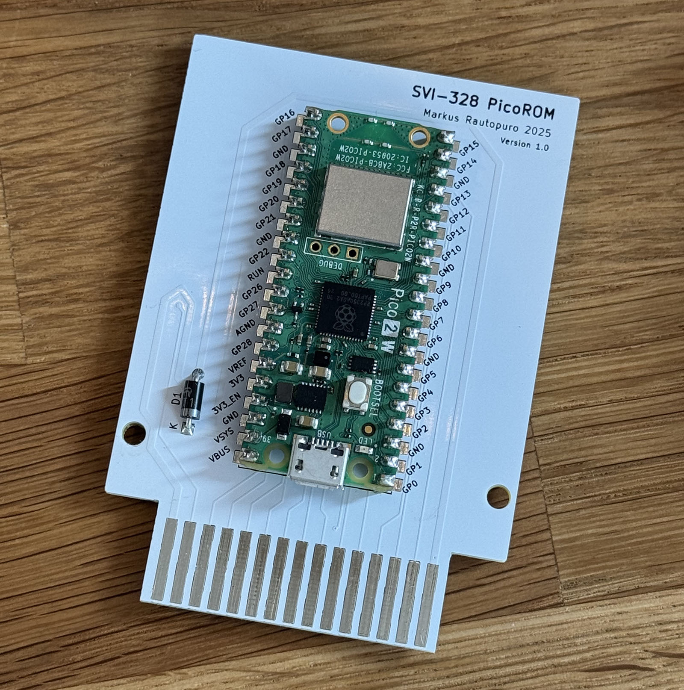
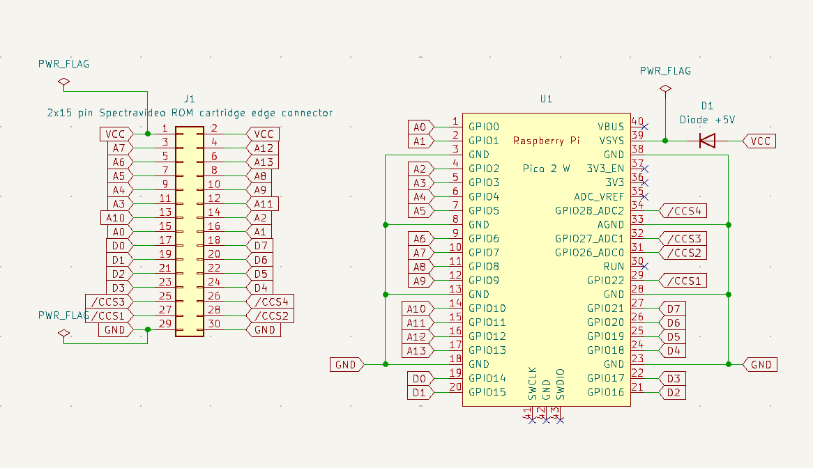

# SVI-328 PicoROM

## Overview

SVI-328 PicoROM is a ROM emulator for Spectravideo 328 which uses a [Raspberry Pico 2 W](https://www.raspberrypi.com/products/raspberry-pi-pico-2/) microcontroller board to emulate a SVI-328 game ROM cartridge.

Designed to integrate into the conventional cartridge slot of the SVI-328, this cartridge allows wireless transmission of ROM games from macOS/PC to the SVI-328 via Wi-Fi without any hardware modifications.



## Repository contents

This repository contains:

 - C firmware source code ([pico](pico/) directory) for Raspberry Pi Pico 2 W responsible for dynamic ROM emulation and wireless data transfer.
 - PCB design files ([pcb](pcb/) directory), including schematics and layouts, developed using KiCad, suitable for fabrication with, for example, [PCBWay](https://www.pcbway.com/).
 - Node.js JavaScript-based utility ([send_rom.js](js/send_rom.js)) designed for remote ROM image transmission via WiFi.
 - Z80 assembly language code ([rom](rom/) directory) constituting the boot-up ROM launcher, facilitating initial system configuration and operational initialization.

## How to get it running quickly

### Cartridge hardware

First, create the PCB by ordering it from [PCBWay](https://www.pcbway.com/) with the Gerber files provided in [release/svi-328-picorom-gerber.zip](release/svi-328-picorom-gerber.zip).

Then get a [Raspberry Pico 2 W](https://www.raspberrypi.com/products/raspberry-pi-pico-2/) (not the version 1, and make sure you order the Wi-Fi version W) and one atleast +5V diode (DigiKey part number 4878-1N4001CT-ND DIODE GEN PURP 50V 1A DO204AC works, for example).

Solder these together. :) 

### Cartridge software

Press Pico's BOOTSEL button (the only button on the board, see the board picture above) and while pressing plug it in to your computer via USB.

Then, find the UF2 flash binary file from [release/svi-328-picorom.uf2](release/svi-328-picorom.uf2).

Next, flash the Raspberry Pico 2 W by dragging the UF2 file on to the Pico USB drive and wait until Pico disconnects (displays `Disk Not Ejected Properly` in macOS) and the green LED light turns on to signal that the firmware booted correctly.

Finally, remove the USB cable and connect the cartridge to SVI-328 and boot it up. (Warning: **DO NOT** connect anything to the cartridge USB port when it is attached to the SVI-328. This will destroy the cartridge.)

### Booting up and sending a ROM


## System prerequisites

The replication and deployment of this project require the following environment configurations:
 - Raspberry Pi Pico SDK installation and associated toolchains.
 - Node.js runtime environment for executing the provided WiFi-based ROM transmission scripts.
 - KiCad for PCB customization, schematic evaluation, and Gerber file generation.

The build scripts have been developed and tested with macOS Sonoma 14.6.1 and requires the following software to be installed:

 - [Visual Studio Code](https://code.visualstudio.com) 1.98.2 or newer 
 - Raspberry Pico Visual Studio Code extensions with [these](https://www.raspberrypi.com/news/get-started-with-raspberry-pi-pico-series-and-vs-code/) instructions
 - picotool 2.1.1, `brew install picotool` with [HomeBrew](https://brew.sh)
 - [z88dk version 2.3](https://github.com/z88dk/z88dk) (currently only z88dk-z80asm is used)
 - [openMSX emulator version 20.0](https://openmsx.org/) (which should be installed in /Applications/openMSX.app)
 - [Node.js version 22.12.10](https://nodejs.org/en) or newer
 - [Node Version Manager 22.12.0](https://github.com/nvm-sh/nvm) or newer (it's easier to manage Node versions with this, but you can omit this you install Node.js some other way)
 - [KiCad version 8.0.6](https://www.kicad.org/download/) or newer

## SVI-318 compatibility

The hardware will work with SVI-318 and the loader software should also work with it, altough it has not been tested on a real device yet.

## Compiling the source code

### The launcher ROM source code for SVI-328

The launcher ROM code is in [rom](rom/) directory and you can compile with the following commands:

```
nvm use
make production
```

This will create the ROM binary and the includable rom.h (for the next step) in `release` directory. Copy the `rom.h` to `pico` directory for the next step:

```
cp release/rom.h ../pico/
```

### Raspberry Pico 2 W firmware source code

The Pico firmware source code is located in [pico](pico/) directory and you can compile it by opening the folder in Visual Studio Code. First time, if you have installed the Visual Studio Code extensions, VSCode will install the Pico SDK and then you can click the `Compile` button in the bottom bar.

If you have the cartridge connected via USB, you can use the `Run` button to flash the firmware directly to the cartridge. Another option is to get the UF2 file from the `build` directory, see section [How to get it running quickly](#how-to-get-it-running-quickly).

### Flashing Wi-Fi credentials to the cartridge

You can flash your Wi-Fi credentials to the cartridge to save some valuable typing time on SVI-328, altough I suggest that you take the time to enjoy the never-seen-before experience to enter SSID and the Password on your Spectravideo 328. :) 

Using the example `wifi-credentials.config.example`, create a `wifi-credentials.config` to the root of the project. Then connect the cartridge via USB and flash the credentials:

```
scripts/write_credentials.sh
```

## Operational framework

### Firmware architecture (Raspberry Pi Pico 2 W)

The firmware executed by the Raspberry Pi Pico 2 W addresses two critical operational roles:

1. **ROM memory emulation**:

    The microcontroller interfaces directly with the SVI-328's cartridge slot to emulate ROM data storage. ROM contents are dynamically allocated and retrieved from the internal memory of the Pico.

2. **WiFi-Based ROM data transmission**:

    ROM images are transmitted wirelessly to the Pico via WiFi. A dedicated JavaScript utility (`send_rom.js`) facilitates the transfer and concurrently provides logging capabilities for debugging and operational monitoring.

The firmware source comprises:

 - `main.c`: Responsible for system initialization, WiFi configuration, and reception and handling of ROM data.
 - `wifi.c/h`: Manages WiFi connectivity, session handling, and data exchange between the Pico and external hosts.
 - `svi-328-cartridge.c/h`: Implements the logic necessary for cartridge ROM emulation.
 - `log.c/h`: Provides logging utilities essential for debugging and real-time data monitoring.

### Hardware design and PCB layout

The project hardware consists of a specialized PCB that integrates the Raspberry Pi Pico W and essential connectors for direct communication with the Spectravideo 328:

 - Edge Connector: Engineered for direct compatibility with the standard SVI-328 cartridge interface.
 - Raspberry Pi Pico W Module: Manages operational logic for ROM emulation and wireless communication protocols.



### Communication between SVI-328 and Pico

The Pico-based cartridge presents itself to the SVI-328 as a memory-mapped ROM with additional control registers in the cartridge address space. The SVI-328 accesses the Pico’s “ROM” as if it were a normal cartridge memory, using the address range 0x0000–0x7FFF when the cartridge is enabled. The Pico’s firmware uses the RP2350’s GPIO to monitor the SVI’s address and control lines and to drive or sample the data bus accordingly:

 - ROM Data Window (0x0000–0x3FFF): When the SVI reads from the lower 16KB of the cartridge space, the Pico responds with byte data from an emulated ROM. On reset, this window contains the boot loader and launcher code. Later, once a game is loaded, this window is updated to expose the game’s ROM data for the SVI to fetch. The Pico monitors the /CCS1 signal (chip-select for 0x0000–0x3FFF) to detect these accesses and output the correct data bytes from its internal memory buffer.
 - Upper ROM Data Window and Control/Status Registers (0x4000–0x7FFF): The upper 16KB of the cartridge space is repurposed as a communication interface. The Pico firmware distinguishes accesses to this range via the /CCS2 signal (chip-select for 0x4000–0x7FFF) and does not treat them as normal ROM reads. Instead, certain addresses in this range act as pseudo-registers for handshaking:
    - 0x7FFF – Pico Status Register: Reading from address 0x7FFF returns a state code byte indicating the Pico’s current status (described below). The SVI’s launcher program polls this address to know what the Pico is doing (e.g., waiting for data, busy, ready, etc.).
    - To prevent accidental writes, the launcher uses an unlock sequence: the SVI must perform a specific sequence of dummy reads from three “signature” addresses (defined in the firmware) before the Pico will accept writes to 0x7F00–0x7F02.
    - 0x7F00 & 0x7F01 – Data Write State Registers: Reading to these addresses allows the SVI to send data to the Pico. In this project, they are used to transmit WiFi credentials (e.g., SSID and password) or other input to the Pico.
    - 0x7F02 – Termination Register: Reading address 0x7F02 signals the end of an input string (used to indicate that the full SSID or password has been sent). This lets the Pico know it has received the complete data item.
    - 0x7F00 - 0x7FFF Data to be transmitted: Reading these addresses will translate to the bytes sent by SVI to Pico.


## Special thanks

This project is based on [A8PicoCart](https://github.com/robinhedwards/A8PicoCart), [PiCOLECO](https://github.com/aotta/PiCOLECO) and learnings from [SVI-328 MegaROM](https://github.com/fitch/SVI-328-MegaROM).

## License

Detailed licensing information is documented within the included [LICENSE](LICENSE) file.